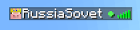
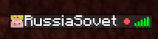
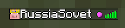
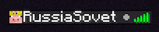

# 🌍 DimensionTracker

**A lightweight Paper plugin that tracks and displays player dimensions with color-coded indicators**

---

*Tab list showing players in different dimensions with color-coded indicators*

---

## ✨ Features

- 🌍 **Real-time tracking** - Automatically detects dimension changes
- 🎨 **Color-coded display** - Green (Overworld), Red (Nether), Purple (End)
- 📊 **Tab integration** - Shows indicators directly in player list
- 👁️ **Privacy mode** - Players can hide their location
- 🔌 **Developer API** - Easy integration for other plugins
- ⚡ **Lightweight** - Minimal performance impact

## 📦 Installation

1. Download `DimensionTracker-Core-X.X.X.jar` from [Releases](../../releases)
2. Place in your `plugins/` folder
3. Restart server
4. Done! No configuration needed

**Requirements:** Paper 1.21.4+ and Java 21+

## 🎮 Commands

| Command | Description | Permission |
|---------|-------------|------------|
| `/dimensions hide` | Hide your location | `dimensiontracker.hide` |
| `/dimensions show` | Show your location | `dimensiontracker.show` |